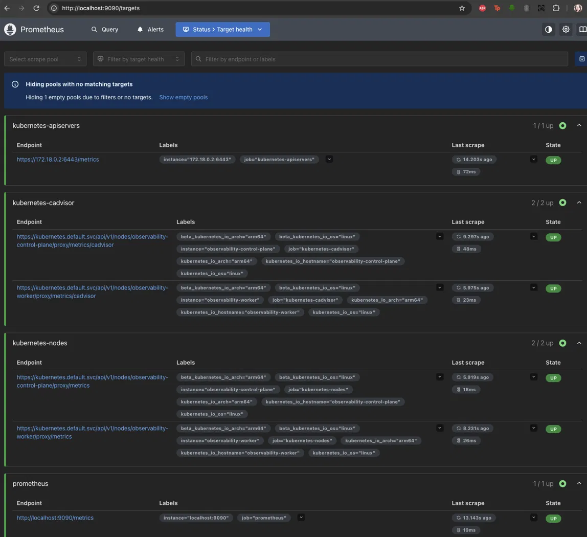
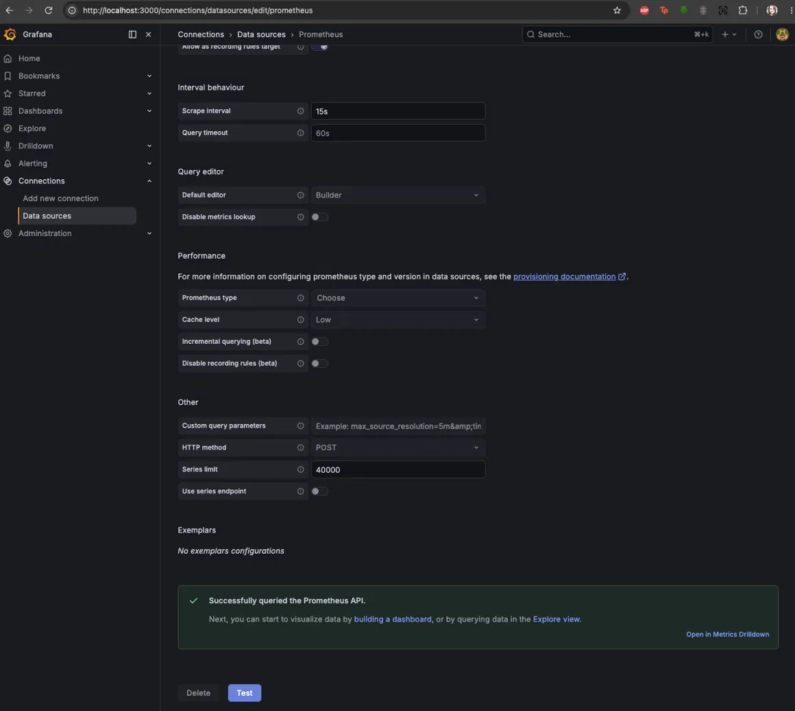
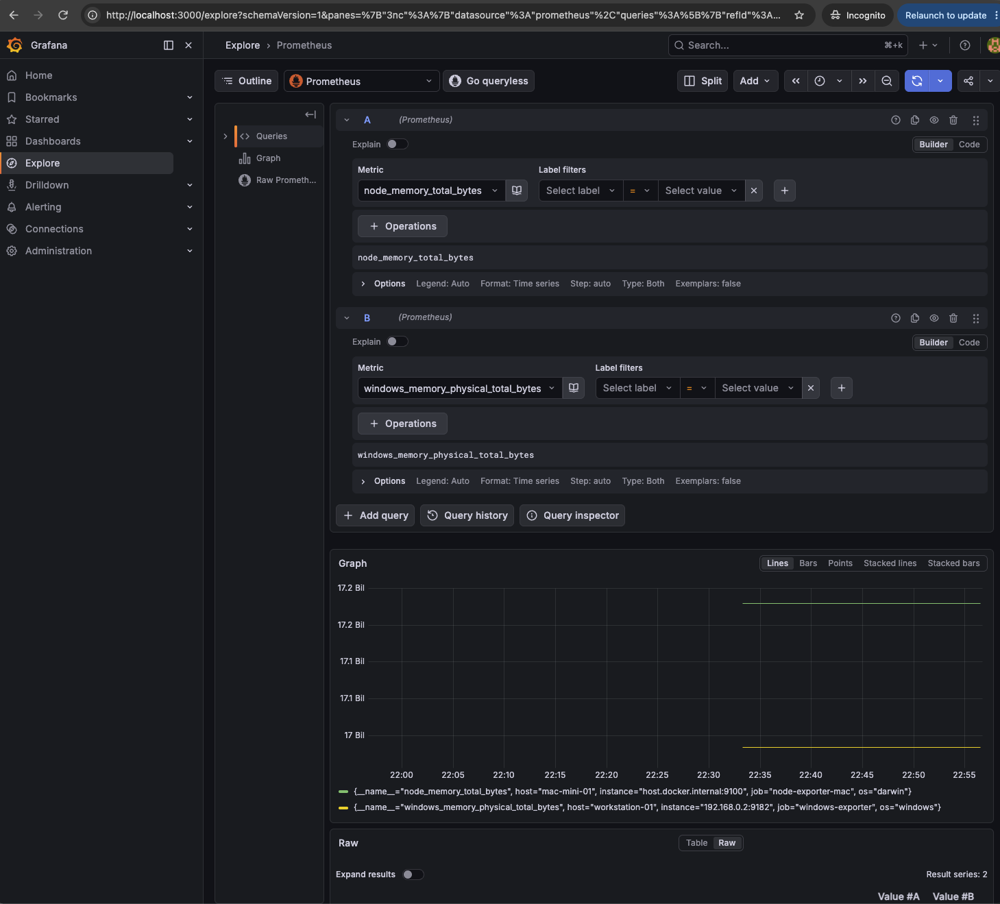
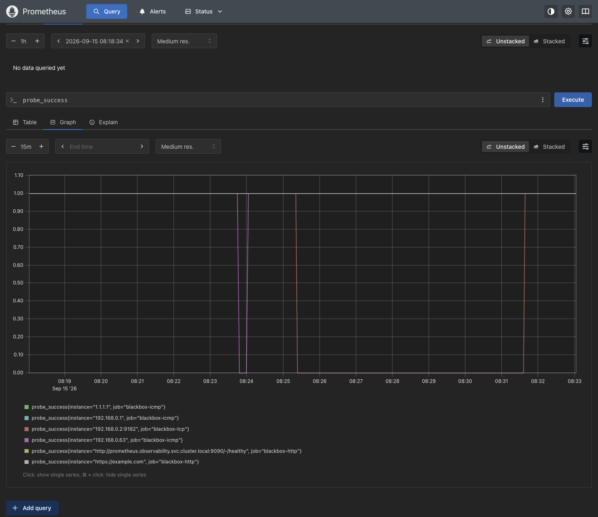

# Local observability lab

A two node Kubernetes cluster running Prometheus and Grafana, deployed from
manifests. No Helm charts, no kube-prometheus-stack: every resource here was
written directly so the moving parts stay visible.

Runs on Apple Silicon. Every image is verified for a `linux/arm64` variant
before use, and the reasoning behind each design choice is recorded in
[docs/decisions.md](docs/decisions.md).

## What it does

- kind cluster, one control plane and one worker
- Prometheus scraping itself, the API server, both kubelets and cAdvisor
- `node_exporter` on the macOS host and `windows_exporter` on a Windows
  machine, both scraped from inside the cluster
- Read only cluster scoped RBAC for the Prometheus ServiceAccount
- Grafana with its Prometheus datasource provisioned from a ConfigMap
- `blackbox-exporter` probing the router, hosts, an IoT device and two
  external control endpoints over ICMP, HTTP and TCP
- Both UIs reachable on the host through kind port mappings

The Kubernetes jobs only report UP if the ServiceAccount token, the ClusterRole
and `nodes/proxy` access all work, so this page doubles as proof the RBAC is
correct.

## Host metrics across two operating systems

Prometheus scrapes `node_exporter` on the macOS host and `windows_exporter` on
a Windows machine on the same LAN. Neither exporter runs in the cluster.

Reaching each host needed a different answer. A pod's `localhost` is the pod
itself, so the Mac is scraped through `host.docker.internal`, the DNS alias
Docker Desktop provides for its host. The Windows machine is a separate device
on the LAN and is reached by its address. Both routes were tested from inside
the cluster before being committed.

The two exporters also use different metric names for the same concept, for
example `node_memory_total_bytes` against
`windows_memory_physical_total_bytes`, so a panel covering both hosts needs one
query per operating system. Full reasoning in D-006 and D-007 of
[docs/decisions.md](docs/decisions.md).

## Black box probing

Six targets probed from inside the cluster by `blackbox-exporter`: the router,
two hosts, one embedded IoT device, and two external endpoints used as
controls. Three modules are configured: `icmp`, `http_2xx` and `tcp_connect`.

A host was taken offline for six minutes. Its probe drops to 0 and recovers,
while the control targets hold at 1 throughout. That contrast is what makes the
signal useful: it separates "this device failed" from "my network failed" or
"the exporter failed".

The narrow dip shortly before it is a different device flapping for about
30 seconds. At a wider graph range the two are indistinguishable, which is why
alert rules need a `for` clause rather than firing on a single failed scrape.

### How the probe jobs work

The scrape target is the exporter, not the device. The address to probe travels
as a URL parameter and is relabelled back into the `instance` label:

    relabel_configs:
      - source_labels: [__address__]
        target_label: __param_target        # becomes ?target=...
      - source_labels: [__param_target]
        target_label: instance              # label the series by the device
      - target_label: __address__
        replacement: blackbox-exporter.observability.svc.cluster.local:9115

The resulting request is
`GET blackbox:9115/probe?module=icmp&target=192.168.0.1`. One exporter serves
every target, and the target list describes what to probe rather than what to
scrape.

### Coverage

Eight of the nine IoT devices have client isolation enabled on the router, so
they cannot be probed from the monitoring host. One is deliberately excluded
from isolation so the probe set includes a real embedded device. The router
offers no SNMP agent, so there is no privileged vantage point onto the isolated
segment either.

Coverage is the main network plus one IoT device, not the whole estate. The
reasoning is in D-009 to D-011 of [docs/decisions.md](docs/decisions.md).

## Access control

Prometheus needs cluster scope for service discovery but no write access
anywhere. The ClusterRole grants `get`, `list` and `watch` on nodes, pods,
services and endpoints, plus `get` on `nodes/proxy` for kubelet and cAdvisor
scraping. Nothing else.

    kubectl auth can-i list nodes   --as=system:serviceaccount:observability:prometheus   # yes
    kubectl auth can-i delete pods  --as=system:serviceaccount:observability:prometheus   # no

## Configuration layout

`config/prometheus/prometheus.yml` is the source of truth for the scrape
config. It is a real Prometheus config file, so `promtool` can lint it.
`manifests/11-prometheus-config.yaml` is generated from it:

    ./scripts/render-configmap.sh

Edit the config file, re-render, apply, then restart Prometheus. Applying a
ConfigMap does not restart the pods that mount it, and Prometheus does not
re-read its config on its own.

## Running it

Requires kubectl, kind, kubeconform and a container runtime. Standalone
binaries work fine; a package manager is not needed.

    kubeconform -strict -summary -ignore-missing-schemas manifests/
    kind create cluster --config cluster/kind-config.yaml
    kubectl apply -f manifests/
    kubectl -n observability rollout status deploy/prometheus deploy/grafana

Prometheus on http://localhost:9090, Grafana on http://localhost:3000.

Teardown:

    kind delete cluster --name observability

## Known limitations

- Grafana's admin password is set through a plain environment variable. It
  belongs in a Secret, generated at bootstrap rather than committed.
- Storage is `emptyDir` with 6h retention. The cluster is disposable by
  design, so metrics do not survive a rebuild.
- Access is via NodePort and kind port mappings rather than an ingress
  controller, which keeps the manifest count down at the cost of realism.
- Host targets are static entries. The Windows address comes from DHCP, so a
  new lease would break the scrape silently.

## Known failure modes

| Symptom | Root cause | Diagnostic |
|---|---|---|
| `localhost:9090` refuses connection | Service nodePort does not match `containerPort` in the kind config | 30090 for Prometheus, 30000 for Grafana |
| Port mapping change has no effect | `extraPortMappings` are fixed at cluster creation | Recreate the cluster |
| Prometheus in CrashLoopBackOff | Malformed scrape config | `kubectl -n observability logs deploy/prometheus` |
| Config change has no effect | ConfigMap applied but pod not restarted | `kubectl -n observability rollout restart deploy/prometheus` |
| Targets return 403 | RBAC | `kubectl auth can-i list nodes --as=system:serviceaccount:observability:prometheus` |
| Host target down, exporter reachable from the host itself | Pod cannot route to the host | Test from inside the cluster with a throwaway busybox pod |
| Windows target down, no obvious cause | Firewall rule scoped to Private while the network is categorised Public | `Get-NetConnectionProfile` on the Windows machine |
| Query returns an empty result but the target is UP | Metric renamed between exporter versions | `curl -s <exporter>/metrics \| grep <keyword>` |
| Datasource test fails, Prometheus healthy | Wrong Service DNS name | Must be `prometheus.observability.svc.cluster.local:9090` |
| Probe target down, device reachable from the host | Client isolation on the router, or a pod-to-LAN routing difference | Test from a pod, not the host |
| All ICMP probes fail, exporter healthy | Missing `NET_RAW` capability | `kubectl -n observability logs deploy/blackbox-exporter` |
| Probe job fails with an invalid port | Typo in the relabel `replacement` | Per-target `lastError` in the targets API |
| `ImagePullBackOff`, exec format error | amd64 only image | Check `docker buildx imagetools inspect <image>` for `linux/arm64` |
